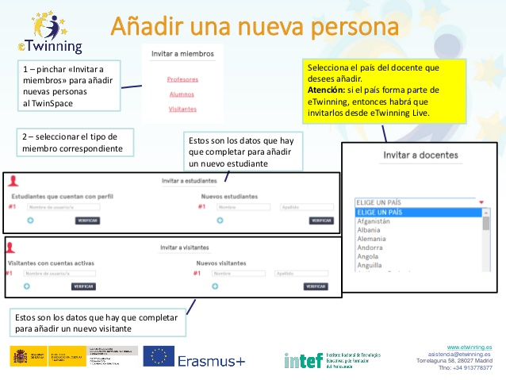

# Añadir una nueva persona.

**Añadir una nueva persona.** Estarás pensando que todo es importante. Pero si hay algo que sobresale por encima del resto, y sin lo cual no se podrían desarrollar los proyectos, son las personas. Por eso queremos que no pares de añadir personas. Si quieres ampliar más información puedes hacerlo en el artículo [Invitar alumnos al nuevo TwinSpace](http://www.etwinning.es/es/formacion/minitutoriales/942-invitar-alumnos-al-nuevo-twinspace) de eTwinning.es. Puedes ver cómo hacerlo en el siguiente listado e imagen.

* 1 – pinchar «Invitar a miembros» para añadir nuevas personas al TwinSpace.

* 2 – seleccionar el tipo de miembro correspondiente.

* Estos son los datos que hay que completar para añadir un nuevo visitante.

* Estos son los datos que hay que completar para añadir un nuevo estudiante.

* Selecciona el país del docente que desees añadir.

* Atención: si el país forma parte de eTwinning, entonces habrá que invitarlos desde eTwinning Live.

