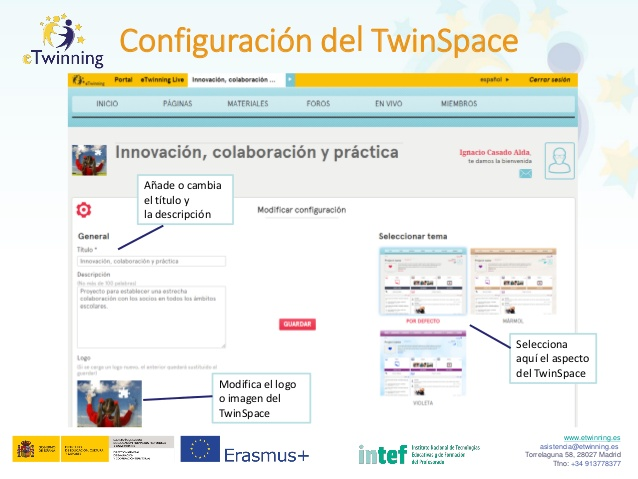

# Configuración del TwinSpace.

**Configuración del TwinSpace.** Para terminar aprenderemos cómo poner “bonito” nuestro TwinSpace. Como verás en la imagen, en este apartado podrás:

* Seleccionar aquí el aspecto del TwinSpace.

* Añadir o cambiar el título y la descripción.

* Modificar el logo o imagen del TwinSpace.

