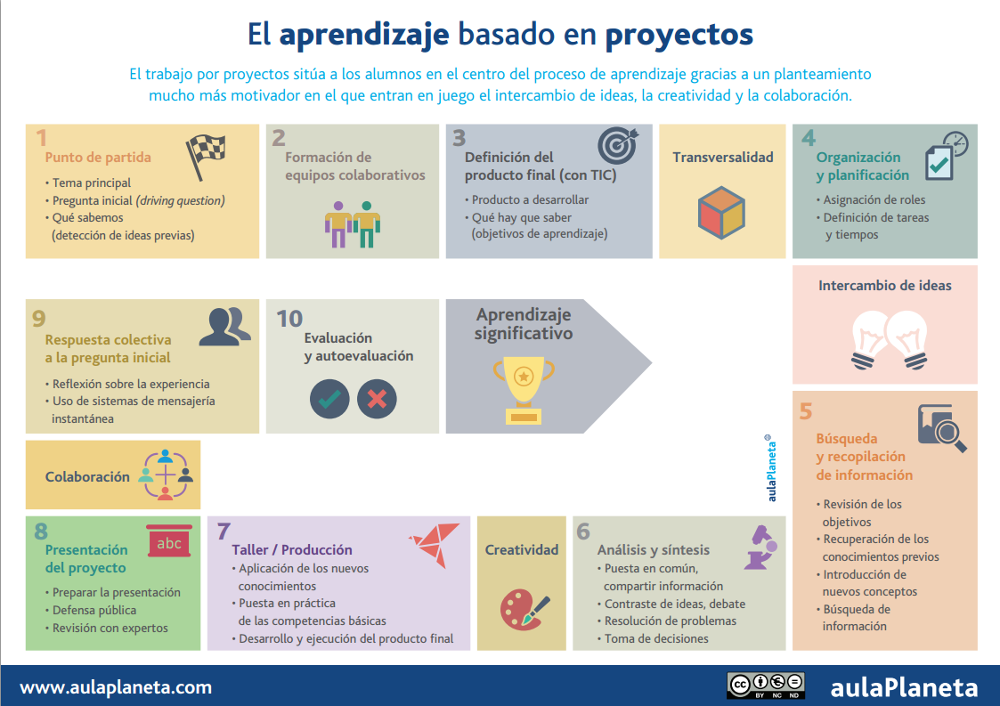
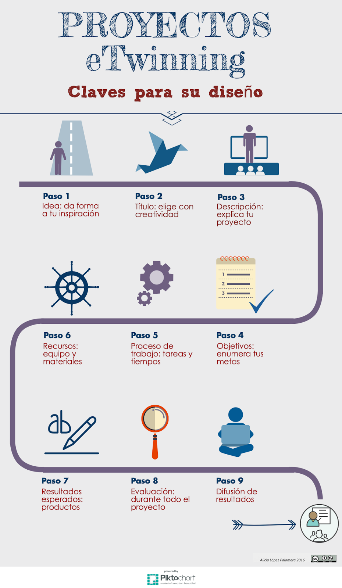
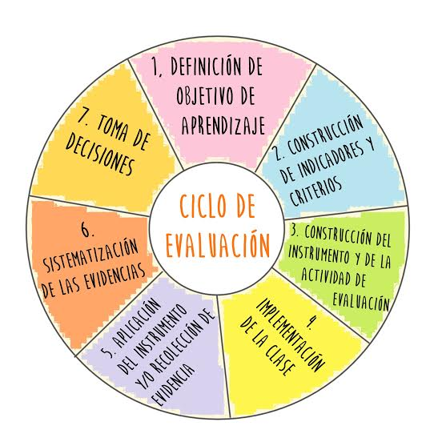

# El ABP: sus pasos y la evaluación.

Como se ha destacado en el apartado anterior, el diseño de un proyecto y su implementación han de realizarse de una forma estructurada y meticulosa que permita que el proceso de aprendizaje se produzca desde la centralidad del alumno y la guía del docente.

En esta parte de contenidos se pretende ayudaros en el camino que hay que seguir para diseñar un proyecto que implemente la metodología ABP en nuestras aulas. Esta metodología será la base sobre la que construiremos posteriormente los proyectos eTwinning.

Fuente: **[Cómo aplicar el aprendizaje basado en proyectos en 10 pasos [infografía]](http://www.aulaplaneta.com/2015/02/04/recursos-tic/como-aplicar-el-aprendizaje-basado-en-proyectos-en-diez-pasos/), Aula Planeta**

El punto de partida es la elección del **tema para el proyecto**. El tema será el eje principal de todo el proyecto y, por tanto, ha de ser realmente motivador, ya que es lo primero que se conoce de él. El tema puede ser elegido por el profesorado, por los alumnos o por un acuerdo entre ellos y estará íntegramente relacionado con el producto final que se decida crear como resultado del proyecto.  

Identificar todos los **contenidos, objetivos y estándares de aprendizaje del currículum** que establece la legislación educativa y que están en relación con el tema de proyecto elegido. Aunque la legislación educativa ofrezca todos estos apartados de forma estanca en diferentes áreas de aprendizaje, en los proyectos estos elementos se mezclan convirtiéndose en algo multidisciplinar. 

Una vez que el camino ha comenzado, hemos de clarificar cuál será nuestra meta, es decir, cuál será el **producto o productos finales** que queremos obtener. Este producto o productos han de relacionarse con el tema del proyecto y con las competencias que el alumnado posea y se quiera desarrollar en ellos.  Es importante tener claro este punto, ya que será nuestra guía para el desarrollo del proceso que se llevará a cabo a lo largo del proyecto. En este apartado tiene cabida cualquier tipo de producto que consideremos, bien aquellos que usan las TIC, bien aquellos que recurren a otro tipo de materiales o ideas. No obstante, el hecho de usar herramientas TIC o en la nube facilitará la posterior difusión del mismo.

Las **competencias a desarrollar** por el alumnado mediante el proyecto están muy relacionadas con el producto elegido, por lo tanto la decisión sobre las mismas puede tomarse incluso antes de definir el producto. El ABP hace que  el alumno desarrolle el aprendizaje mediante la acción (**Learning by doing**), lo cuál supone que la adquisición de competencias sea más real y concreta que mediante otro tipo de metodología.

Cuando todos los pilares anteriores están completamente claros y fijados es cuando se es capaz de diseñar el **itinerario de aprendizaje** que los alumnos llevarán a cabo. Para ello es necesario que se trabaje sobre tres puntos principales:

* **Agrupamiento del alumnado**:** En función del tipo de tareas que se vayan a llevar a cabo elegiremos una forma de trabajar u otra. Siempre siendo importante el establecimiento de roles de trabajo y normas de trabajo. Este punto nos asegurará que los alumnos tengan claras sus responsabilidades y sus funciones en cada momento.

* **Temporalización**:** Para un buen desarrollo y finalización del proyecto es necesario establecer periodos de realización de las actividades, ofreciendo al alumnado tiempo para el diálogo y la discusión, para la creación, para la realización y la corrección. También es imprescindible fijar fechas para cada una de las fases o tareas, así como para la entrega y presentación del producto final. La exigencia en los tiempos hará que el trabajo sea más fructífero.

* **Tareas a realizar**:** En el ABP el docente se convierte en guía y diseñador del itinerario de aprendizaje, por lo tanto, se han de crear diferentes tareas que promuevan la investigación, la creatividad, la comunicación y  la reflexión del alumno. Estas tareas tendrán como único objetivo el acercamiento progresivo del alumno al aprendizaje de los contenidos establecidos y la realización del producto final. Si buscamos el desarrollo de la autonomía del alumnado en su aprendizaje será necesario ofrecer herramientas de ayuda (tutoriales, presentaciones ejemplo, rúbricas guía,...) para que así puedan hacerlo. A mayor explicitación de la actividad, mayor facilidad para que el alumno sea autónomo y mayor oportunidad para que el docente individualice el proceso de aprendizaje. A la hora de elaborar y diseñar las tareas eTwinning es necesario fomentar la colaboración entre los propios alumnos de un centro escolar  y los de los otros centros que forman parte del proyecto. En el siguiente apartado nos centraremos en el trabajo de la colaboración en eTwinning.

[Claves para un proyecto eTwinning,](http://embajadoresetwinning.blogspot.com.es/2016/01/infografia-sobre-el-diseno-de-proyectos.html) Alicia López Palomera, ([CC BY-NC](http://creativecommons.org/licenses/by-nc/3.0/es/))

Una vez finalizado, llega un momento importante para cualquier proyecto: **la evaluación**. Los contenidos llevan consigo aparejados contenidos y competencias cuya adquisición y consecución hemos de evaluar.

La evaluación de todo el conjunto no ha de estar sólo en manos del docente, sino que han de estar presente todos los actores que participan en el proceso de aprendizaje: el alumno, su equipo de trabajo y el profesor. Todos ellos tendrán algo que aportar a la evaluación. Para ello establecemos tres tipos de evaluación:

* **Heteroevaluación**: Es aquella que se produce desde el punto de vista del docente, de la persona que ha diseñado el itinerario de aprendizaje y pretende evaluar la consecución y adquisición de los objetivos y las competencias planteadas. El mejor instrumento para la realización de esta evaluación será la rúbrica de evaluación, en la cual, desde el principio del proceso, el docente le muestra al alumno cuáles serán los aspectos que serán evaluados y cual ha de ser el resultado obtenido en función del grado de consecución dentro de esos aspectos.

* **Co-evaluación**:  Es la evaluación realizada por los iguales, es decir, por los alumnos. Normalmente fruto de esta evaluación, los docentes obtendremos la visión de los alumnos sobre sus compañeros y el trabajo en equipo, la cooperación y la colaboración. 

* **Autoevaluación**:  Y, por último, el punto de vista del propio alumno sobre su trabajo y adquisición y consecución de competencias y objetivos. Para ello podremos utilizar la rúbrica de evaluación acompañada de algún instrumento que permita al alumno expresar su propia evaluación y los motivos de la misma. En muchas ocasiones este tipo de evaluación no sólo nos ofrecerá información acerca de su visión de la tarea, el producto final y sus logros sino acerca de su autoestima y la percepción que tiene sobre sí mismo.

Este tipo de evaluación es utilizada para las tareas y los productos llevados a cabo siguiendo la metodología ABP. Si bien cuando esta metodología es aplicada en el desarrollo de un proyecto eTwinning hemos de **añadir un tipo de evaluación que será la del propio proyecto.** En esta evaluación se encontrarán implicados todos aquellos que hayan formado parte del proyecto de una manera u otra (alumnos, docentes, familias, instituciones o asociaciones, etc...)

Esta evaluación será una **evaluación cualitativa y cuantitativa** en la que se trata de recoger el mayor número de datos y opiniones acerca del desarrollo del proyecto, adecuación de los contenidos, colaboración y cooperación llevada a cabo entre alumnos y entre los centros implicados. 

[Ciclo de Evaluación,](https://commons.wikimedia.org/wiki/File:Ciclo_de_evaluaci%C3%B3n.jpg) Anarebolledok, ([CC BY-SA 4.0](https://creativecommons.org/licenses/by-sa/4.0/)) 
