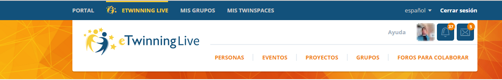
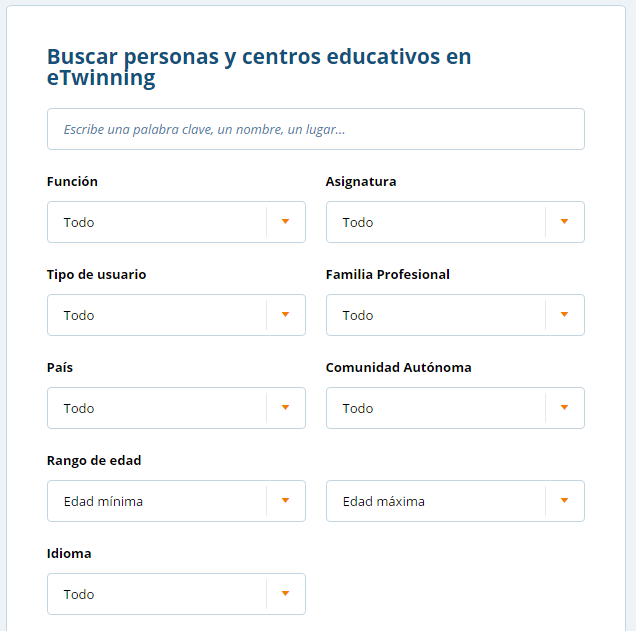
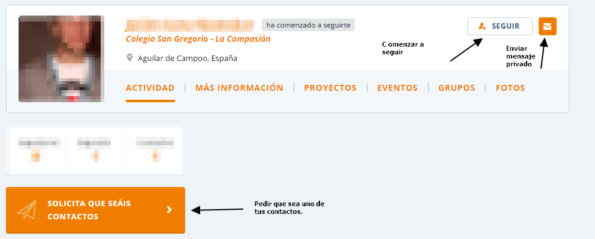
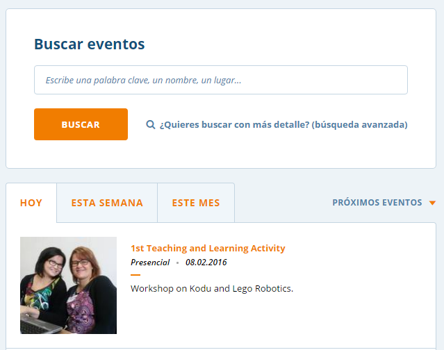
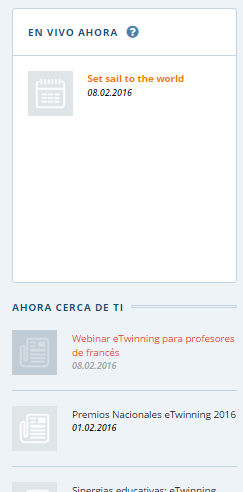
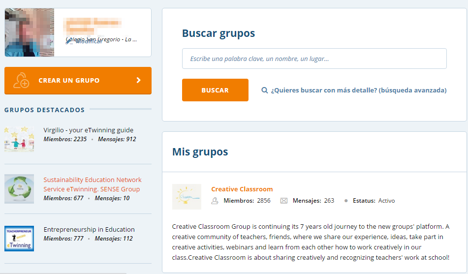
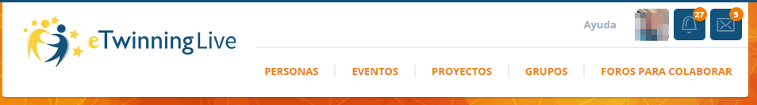
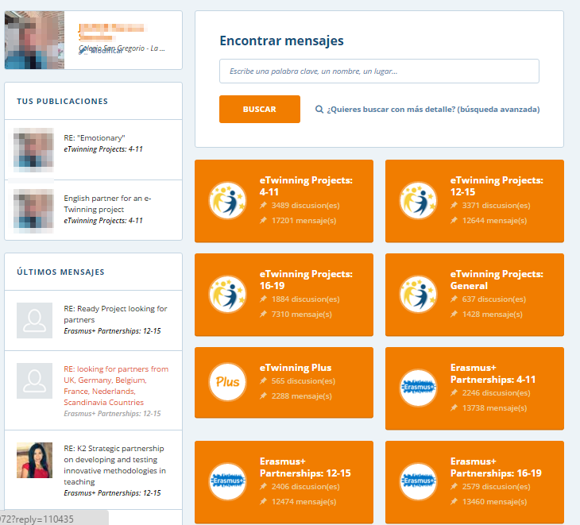
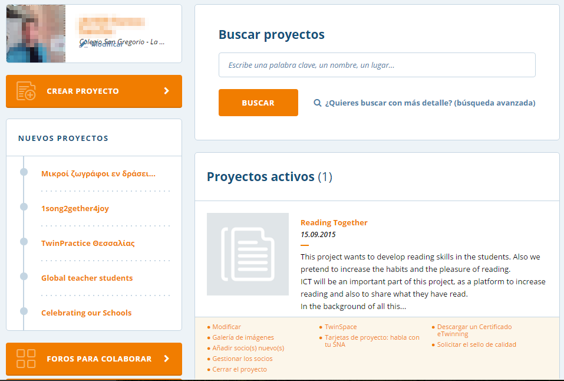

# El escritorio eTwinning Live.

El escritorio <strong>eTwinning Live,</strong> de reciente creación, es el lugar en que encontrarás tu perfil una vez te hayas inscrito en la plataforma. Desde ahí, podrás ponerte en contacto con otros docentes europeos, registrar tus proyectos, ponerte en contacto con el Servicio Nacional de Apoyo, etc.

Imagen tomada de [eTwinning Live](https://live.etwinning.net/unauthorized)

Lo primero que ofrece la plataforma (y que has de realizar sin falta) es la actualización de tu perfil. Recuerda que el intercambio es primordial en los proyectos eTwinning y nuestros futuros socios se pondrán en contacto con nosotros a través del perfil, por lo que será necesario que tu perfil sea lo más completo posible, mostrando todo aquello que puedes ofrecer.

Imágenes tomadas de [eTwinning Live](https://live.etwinning.net/unauthorized)

Por otro lado, no tenemos que esperar a que se pongan en contacto con nosotros. También podremos buscar docentes con los que entrar en contacto porque nos puedan resultar interesantes a la hora de trabajar, crear o diseñar un proyecto. La búsqueda nos permite focalizar nuestra atención en diferentes aspectos que nos interesan: país de procedencia, edad del alumnado, materias, rol dentro de la comunidad eTwinning. Esto nos ayudará a que, con mayor facilidad y rapidez, podamos entrar en contacto con aquellas personas que pueden resultarnos de interés.

Imagen tomada de [eTwinning Live](https://live.etwinning.net/unauthorized)

Una vez que hemos encontrado a alguién que realmente nos interesa podemos entrar en contacto con él directamente a través de un mensaje privado; también podemos comenzar a seguir sus publicaciones y actividades dentro de la red eTwinning y podemos convertirle en uno de nuestros contactos, quedando registrado en una lista que nos ayudará a volver a contactar con él de un manera más rápida y fácil en futuras ocasiones. 

Imagen tomada de [eTwinning Live](https://live.etwinning.net/unauthorized)

El escritorio eTwinning Live contiene un apartado dedicado a los eventos que están teniendo lugar dentro de la comunidad. Dichos eventos pueden ser programados por cualquier miembro, tú mismo puedes hacerlo, y pueden ser de carácter formativo sobre un tema o pueden formar parte de algún proyecto que está siendo llevado a cabo. Los eventos podrán ser presenciales o conectados. Y cada usuario podrá crear los suyos propios.

Imagen tomada de [eTwinning Live](https://live.etwinning.net/unauthorized)

El propio eTwinning Live se encarga de tenernos informados acerca de cuáles son las novedades o qué está sucediendo ahora mismo en la plataforma. En el apartado  “ahora cerca de ti”, podrás encontrar las noticias y eventos ofrecidos por el SNA, con el link al mismo para encontrar más información. Este apartado te mantendrá al día de cuanto sucede y acontece. Presta atención a toda la información que ahí se vierte. 

Imagen tomada de [eTwinning Live](https://live.etwinning.net/unauthorized)

Uno de los grandes puntos para el desarrollo profesional ofrecido desde el escritorio eTwinning Live es la oportunidad de formar parte de grupos de docentes unidos por algún tema u objetivo en concreto. En los mismos, los docentes interesados comparten ideas, crean materiales, programan eventos educativos e incluso diseñan proyectos comunes. Como docente participante en la plataforma tú mismo puedes crear un grupo sobre algún tema sobre el que formarte o, por qué no, sobre el que formar a otros docentes, o meramente usarlo para compartir.

Imagen tomada de [eTwinning Live](https://live.etwinning.net/unauthorized)

Para concluir con esta parte de red social que tiene  eTwinning Live, éste nos ofrece la comunicación de las notificaciones que otros usuarios nos han realizado : solicitud de contacto, actividad en un proyecto, etc… Así como un correo interno en la plataforma que nos permitirá especialmente comunicarnos con nuestros socios o con aquellos usuarios con los que queremos comenzar a trabajar juntos. 

Imagen tomada de [eTwinning Live](https://live.etwinning.net/unauthorized)

El momento de comenzar a diseñar un proyecto o buscar cómo ponerlo en marcha incluye la búsqueda y localización de socios para trabajar con ellos. Podemos preferir echar a andar con ayuda de algún proyecto ya diseñado: esta puede ser una buena manera de aprender.  El apartado de Foros para colaborar es el lugar idóneo para comenzar a buscar a través de diferentes post que cada profesor y sus necesidades van creando.

Dichos foros se organizan en preferencia de edades o en preferencia de programas a emplear, siendo estos foros un lugar muy fiable y con altos resultados para encontrar socios también para un programa Erasmus+.

Imagen tomada de [eTwinning Live](https://live.etwinning.net/unauthorized)

En el escritorio tendremos un apartado en el que quedan registrados todos los proyectos en que vamos participando, bien como creador del mismo, bien como participante. En este apartado es donde podremos registrar y crear un nuevo proyecto siguiendo los pasos. Este apartado nos llevará muy pocos minutos si tenemos las ideas claras, ya que lo que el portal nos solicita es que vayamos rellenando un formulario prefijado con información sencilla y básica sobre el proyecto. 

Es también en este apartado de proyectos en el que podremos realizar todo aquello que tenga que ver con nuestros proyectos abiertos; 

<li dir="ltr">
Acceder al TwinSpace (lugar seguro y cerrado en el que se van desarrollando los proyectos)
</li>
<li dir="ltr">
Descargar un certificado eTwinning (documento en el que el SNA acredita tu participación en dicho proyecto).
</li>
<li dir="ltr">
Gestionar los socios del proyecto (consultar los que ya forman parte e incluir nuevos socios)
</li>
<li dir="ltr">
La modificación y cierre del proyecto a la conclusión del mismo.
</li>
<li dir="ltr">
Las tarjetas del proyecto que te ayudarán de una forma sencilla y rápida a contactar con tu SNA para cualquier consulta o duda acerca del proyecto.
</li>
<li dir="ltr">
Y por último y tras la finalización podrás solicitar el Certificado de Calidad del proyecto a tu SNA.
</li>

Descargar un certificado eTwinning (documento en el que el SNA acredita tu participación en dicho proyecto).

La modificación y cierre del proyecto a la conclusión del mismo.

Y por último y tras la finalización podrás solicitar el Certificado de Calidad del proyecto a tu SNA.

Imagen tomada de [eTwinning Live](https://live.etwinning.net/unauthorized)
