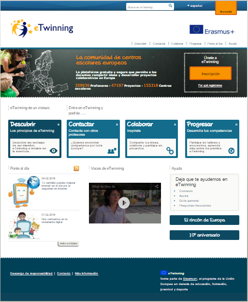
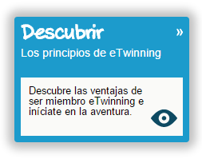
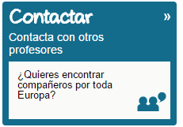
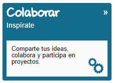
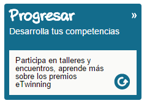
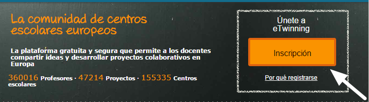

# El portal eTwinning.

El[ portal público de eTwinning ](https://www.etwinning.net/es/pub/index.htm)es el primer contacto que tenemos con el mundo eTwinning y sirve de punto de unión de unos 360.000 docentes europeos.

Imagen tomada: [Portal eTwinning](https://www.etwinning.net/es/pub/index.htm)

Entre los aspectos más destacables de este portal encontramos:

<li dir="ltr">
[Descubrir:](https://www.etwinning.net/es/pub/discover.htm)
</li>

 ¿Sabes cuáles son las ventajas de ser miembro e inciarte en la aventura eTwinning?

Imagen tomada [Portal eTwinning](https://www.etwinning.net/es/pub/index.htm)

En este apartado del portal te contamos todo lo que necesitar saber para comenzar. Puedes convertirte en un eTwinner en [cuatro sencillos pasos](https://www.etwinning.net/es/pub/discover/how_to_get_involved.htm).

Existe una [recopilación de publicaciones](https://www.etwinning.net/es/pub/discover/publications.htm) realizadas para mostrarte cómo conseguirlo, ayudándote, además, a conocer más y contrastar la información viendo diferentes puntos de vista. Todas las publicaciones se encuentran en formato pdf y son descargables en diferentes idiomas.

Hay mucha gente que ya ha puesto en práctica diferentes proyectos y que aconseja poniendo [voz a su experiencia](https://www.etwinning.net/es/pub/discover/people_say.htm) o a su relación con eTwinning y sus beneficios: desde autoridades políticas, miembros de los servicios nacionales de apoyo y docentes.

<li dir="ltr">
[Contactar:](https://www.etwinning.net/es/pub/connect.htm)
</li>

Una de las mejores maneras de comenzar es ver, disfrutar y aprender de diferentes proyectos ya realizados. 

Imagen tomada [Portal eTwinning](https://www.etwinning.net/es/pub/index.htm)

En el siguiente apartado podrás [conocer y entrar en contacto](https://www.etwinning.net/es/pub/connect/browse_people_schools_and_pro.htm) con diferentes docentes, proyectos, colegios y realizar la búsqueda de los mismos por diferentes aspectos: edad, lugar, país, materias,...

<li dir="ltr">
[Colaborar:](https://www.etwinning.net/es/pub/collaborate.htm)
</li>

Si necesitas inspiración para crear y diseñar, este apartado puede ayudarte mucho. 

Imagen tomada [Portal eTwinning](https://www.etwinning.net/es/pub/index.htm)

eTwinning nos ofrece numerosos [kits](https://www.etwinning.net/es/pub/collaborate/kits.cfm) que guiarán nuestros inicios hacia el éxito en el diseño e implementación de los proyectos; también existen [módulos](https://www.etwinning.net/es/pub/collaborate/modules.htm) que podemos incorporar a nuestros diseños. 

En la galería de proyectos podremos encontrar grandes ejemplos de proyectos que se han diseñado e implementado. Todos ellos han sido designados como Buenas Prácticas, por lo tanto serán buenos “espejos” para que nuestros proyectos sean grandes eventos de colaboración y aprendizaje en nuestras aulas.

<li dir="ltr">
[Progresar:](https://www.etwinning.net/es/pub/progress.htm)
</li>

eTwinning quiere ayudarte a que puedas formarte  y conocer sus herramientas y posibilidades. 

Imagen tomada [Portal eTwinning](https://www.etwinning.net/es/pub/index.htm)

De forma periódica, y de forma variada, el portal ofrece oportunidades de formación y desarrollo profesional a los docentes:

<li dir="ltr">
Talleres: ayudan a conocer más eTwinning y la colaboración europea.
</li>
<li dir="ltr">
Encuentros didácticos: eventos cortos, pero intensos, centrados en algún tema y dirigidos por un experto. Son virtuales, cortos e intensivos, promoviendo el debate entre profesores europeos. 
</li>
<li dir="ltr">
Grupos eTwinning: son grupos privados y cerrados en los que los docentes debaten de forma abierta sobre un tema en concreto. Cada usuario puede crear los suyos propios.
</li>

Encuentros didácticos: eventos cortos, pero intensos, centrados en algún tema y dirigidos por un experto. Son virtuales, cortos e intensivos, promoviendo el debate entre profesores europeos. 

El portal nos abre la puerta al siguiente paso y a la siguiente plataforma, [eTwinning live](https://live.etwinning.net/unauthorized). Para el uso de esta parte tendremos que registrarnos.  

Imagen tomada [Portal eTwinning](https://www.etwinning.net/es/pub/index.htm)

 
