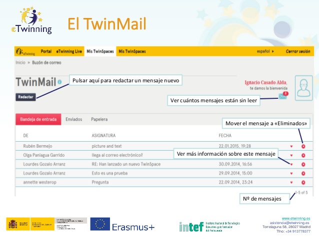

# El TwinMail.

**El TwinMail.**  Es una herramienta de mensajería comparable al correo electrónico. Todos los miembros de los TwinSpaces pueden enviar mensajes al resto de participantes en la plataforma. Se pueden adjuntar archivos en los mensajes, además de guardar los mensajes. En la siguiente imagen hay más información.

* Ver cuántos mensajes están sin leer.

* Ver más información sobre este mensaje.

* Mover el mensaje a «Eliminados».

* Nº de mensajes.

* Pulsar aquí para redactar un mensaje nuevo.

