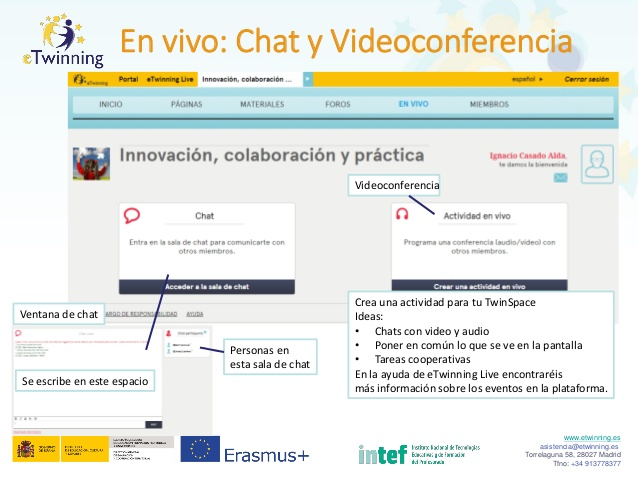
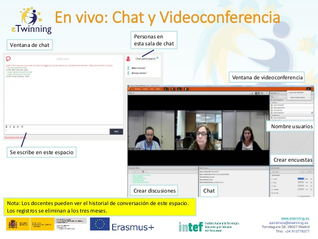

# En vivo: Chat y videoconferencia.

**En vivo: Chat y videoconferencia.** En las siguientes dos imágenes os mostraremos cómo es posible mantener chats y videoconferencias dentro de la plataforma TwinSpace. Esto os ayudará a hacer más fácil la comunicación entre los participantes de vuestro proyecto, así como a hacer más “real” vuestro proyecto.

* Se escribe en este espacio.

* Videoconferencia.

* Ventana de chat.

* Personas en esta sala de chat.

* Crear una actividad para tu TwinSpace. Ideas:

    * Chats con video y audio.
    * Poner en común lo que se ve en la pantalla.
    * Tareas cooperativas.

En la ayuda de eTwinning Live encontraréis más información sobre los eventos en la plataforma.

* Ventana de chat.

* Personas en esta sala de chat.

* Se escribe en este espacio.

* Ventana de videoconferencia.

* Crear encuestas.

* Chat.

* Crear discusiones.

* Nombre usuarios.

> Nota: Los docentes pueden ver el historial de conversación de este espacio. Los registros se eliminan a los tres meses.
