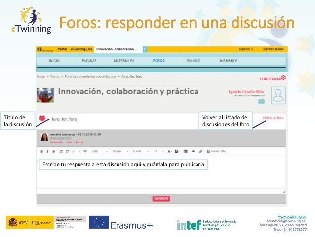

# Foros: responder a una discusión.

**Foros: responder a una discusión.** Si tan importante es abrir una discusión, no lo es menos responder y continuar con la discusión para que no muera y así crear un clima de convivencia en el proyecto. La imagen inferior escenifica lo que encontrarás.

* Título de la discusión.

* Volver al listado de discusiones del foro.

* Escribir tu respuesta a esta discusión aquí y guardar para publicarla.

