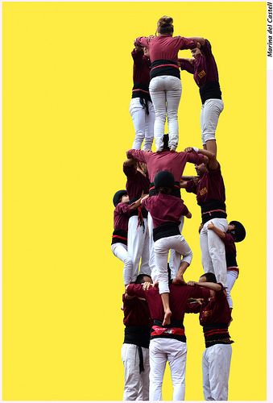

# La colaboración en eTwinning

La colaboración en eTwinning es el aspecto fundamental para desarrollar un buen proyecto eTwinning y es la clave para el éxito de dicho proyecto.

Aunque el aspecto básico en un proyecto eTwinning es la colaboración entre los centros participantes. Es importante hacernos la siguiente pregunta para tener más claro la idea clave de este bloque.

## ¿Qué no es colaborar?

Fuente: [Photo for class](http://www.photosforclass.com/download/5098201846)

Muchos de nosotros estamos acostumbrados a oír esta palabra y utilizarla en nuestro vocabulario del día a día, pero a veces tenemos una visión distorsionada del significado y por eso es imprescindible tener una respuesta a esta pregunta.

Colaborar no sería el que los alumnos realicen las actividades de manera paralela en sus centros, obteniendo un resultado final independiente. 

Tampoco lo conseguiríamos aunque nos comunicáramos y nos mostráramos esos productos finales, ni siquiera estaríamos colaborando si sumáramos los productos y los presentáramos como un único producto final.

Por estas respuestas y muchas otras que nos puedan surgir, vamos a desgranar lo que es colaborar y aprenderemos reglas de oro para el éxito en un proyecto eTwinning.

## ¿Qué es colaborar?

La Real Academia de la Lengua Española dice que colaborar es **“****trabajar con otra u otras personas en la realización de una obra”**. Es decir, consiste en realizar algo de manera conjunta desde el inicio, en su desarrollo y en su finalización.

Fuente: [Photo for class](http://www.photosforclass.com/download/15167193342)

Hay puntos clave en la colaboración que debemos tener en cuenta para poder llegar al éxito. Por ejemplo cuando realizamos este proceso seguramente partiremos de ideas muy diferentes y necesitaremos buscar el consenso. Para conseguir el consenso tendremos que negociar y debatir, eso implicará tener una mente abierta y disponer de tiempo para hacerlo. La frase “mente abierta” es uno de los objetivos que persiguen los proyectos eTwinning ya que facilitan la interacción de diferentes puntos de vista ya sean culturales, sociales, raciales, etc…   y como consecuencia de este objetivo y el uso del trabajo colaborativo, nuestra sociedad se convierte en más tolerante y respetuosa. Además, no debemos olvidar que muchas veces el tener consenso significa renunciar a las ideas propias en favor de las propuestas de nuestros socios.

Las actividades colaborativas entre colegios participantes van más allá de la comunicación: los alumnos no son meros receptores de información; ellos son miembros de un equipo, co-autores y co-creadores. Es decir, son partícipes de todo el proceso del proyecto desde el inicio, su desarrollo y el final. Es aquí donde el docente tiene el papel más importante, debe crear el escenario y las condiciones adecuadas para que la colaboración surja y los alumnos aprendan el proceso de colaborar. Ahí surgirá un rol de guía acompañante por parte del maestro para llevar a buen fin el proceso colaborativo.

En cuanto a la colaboración en un proyecto, dicho término significa que ambas clases o centros necesitan de la contribución de sus compañeros para realizar y terminar la tarea.

Trabajar con grupos mixtos de diferentes nacionalidades o centros participantes es muy efectivo para el éxito de una tarea colaborativa. Es decir aunar un pequeño grupo de una clase de un centro participante con otro pequeño grupo de otro centro participante dará como resultado un grupo mixto con diferentes nacionalidades o centros diferentes.

Lo descrito anteriormente sería una regla de oro para el éxito de una tarea colaborativa eTwinning. En el siguiente apartado recogeremos las mismas extraídas de la presentación [Collaborative Activities: the key to succesful eTwinning projects](https://prezi.com/mwyoih3ty1dm/expert-talk-collaborative-activities-the-key-to-successful-etwinning-projects/?utm_campaign=share&amp;utm_medium=copy) de Irene Pateraki y Paraskevi Belogia.

 

## Las reglas de oro.

Como toda buena tarea o proyecto debe haber unas reglas que seguir y cumplir para garantizar el éxito de dicha tarea o proyecto. A continuación enumeramos nueve reglas de oro que harán de tu proyecto colaborativo eTwinning una garantía de éxito.

1. **Llegar a conocer a tus compañeros.** Es decir comparte toda la información necesaria con tus compañeros:

    * Número de estudiantes que participan en el proyecto.
    * La edad de los estudiantes y sus hobbies o intereses.
    * El nivel de los estudiantes tanto en las lenguas extranjeras como su competencia digital.

2. **Crear un calendario detallado.** Es decir, tener por escrito y marcado en un calendario compartido:
    * Fijar las fechas de inicio para cada tarea.
    * Marcar las fechas de períodos vacacionales de cada centro participante.
    * Compartir el calendario con los estudiantes.
    * Fijar las fechas de finalización y cumplirlas.

3. **Crear un plan preliminar para llevar a cabo un proyecto eTwinning exitoso.**

    * Planear un encuentro, introducir el proyecto a los alumnos e informar a las familias, los compañeros y el director sobre los puntos específicos del proyecto.
    * Añadir más maestros de tu escuela al proyecto y formar equipos de trabajo en tu centro.
    * Anunciar el inicio del proyecto en la página del colegio.
    * Crear cuentas en Twinspace para todos los participantes e invitar a los estudiantes al Twinspace.
    * Organizar talleres para tus estudiantes para desarrollar la competencia digital y las herramientas 2.0 que vayan a ser usadas en el proyecto, así como aprender a manejar la plataforma Twinspace.
    * Crear tutoriales de Twinspace tutorials para los estudiantes y compañeros que sean primerizos en eTwinning (en el caso que sea necesario).

4. **Diseñar tu Twinspace cuidadosamente.** Es decir tómate tu tiempo para diseñar el espacio que durante el proyecto vais a compartir tú y tus socios:
    * Crear tantas páginas como tareas o actividades están planificadas dentro del proyecto.
    * Añadir una breve descripción por cada uno de las tareas propuestas al principio de las mismas.
    * Ponerse de acuerdo con los socios sobre cuáles son las herramientas que mejor encajan en cada una de las tareas e invitarles a que editen las páginas de las actividades..

5. **Romper el hielo para que lleguen a conocer unos a otros.** Es decir haz del proyecto una comunidad de aprendizaje donde la interacción entre el alumnado sea fundamental para ampliar su motivación.
    * Crea momentos, actividades, tareas, etc… que hagan que los alumnos interaccionen entre ellos lo más posible.
    * Anima a los estudiantes a actualizar sus perfiles en Twinspace y a que añadan una breve descripción de ellos mismos así como un avatar representativo.
    * Anima a los estudiantes a dejar comentarios en el muro de los estudiantes participantes.
    * Crea actividades para dinamizar los perfiles en Twinspace. Ejemplo: Vota por el mejor perfil Twinspace.
    * Planea sesiones de chat o videoconferencia de forma regular.
    * Ofrece y encuentra maneras creativas para que los estudiantes se presenten a sí mismos, su escuela o su país.

6. **Une a los estudiantes en grupos transnacionales.** Es decir crea grupos mixtos transnacionales, ya que durante el proceso tendrán que comunicarse entre ellos y tomar decisiones conjuntas que afecten a los productos finales.
    * Distribuye a los alumnos de los socios en equipos o grupos mixtos.
    * Crea una tabla con los nuevos grupos mixtos transnacionales formados y añade la tabla al Twinspace.
    * Anima a los estudiantes a trabajar juntos y escribir una breve descripción sobre los componentes del grupo. Herramienta recomenda: [Titanpad](https://titanpad.com/).
    * Anima a los estudiantes a crear un nombre del grupo y dibujar juntos un símbolo o emblema del mismo. Herramienta recomenda: [DrawitLive](http://www.drawitlive.com/).

7. **Planea tantas tareas colaborativas como sea posible.** Es decir haz todo lo posible para que las tareas o actividades a realizar promuevan la colaboración entre el alumnado. 
    * Intenta planear las tareas o actividades donde la contribución de los todos los miembros sea necesaria para completar dicha tarea o actividad.
    * Usa el mayor número de herramientas colaborativas que sea posible. Ejemplos: [Google.Docs](https://www.google.es/intl/es/docs/about/), [Prezi](https://prezi.com/), [DrawitLive](http://www.drawitlive.com/), [Glogster](https://www.glogster.com/), etc)
    * Intenta evitar la creación de carpetas para cada socio en Twinspace. Las tareas o actividades colaborativas exitosas son aquellas en las cuales no se puede decir qué compañero ha hecho una u otra tarea.

8. **Asigna responsabilidades a los estudiantes.** Es decir, cuanto más responsables del proyecto sean tus estudiantes más partícipes y motivados estarán, lo que le proporcionará a tu proyecto una garantía de éxito. Evidentemente esta regla dependerá de la etapa educativa en la que se realice el proyecto.
    * Descubre el talento de tus estudiantes y sus habilidades dándoles responsabilidad en el proyecto y tareas a realizar.
    * Une a los estudiantes en grupos de acuerdo a sus gustos, habilidades o talentos (el grupo de pintura, el grupo de fotografía, el grupo TIC, etc)
    * Asigna a algunos estudiantes roles de administrador en Twinspace.

9. **Fija criterios de evaluación.** Es decir, cualquier proyecto que se precie tiene que tener marcados unos criterios de evaluación que hagan palpable la mejora del mismo a través del análisis de dichos criterios.
    * Intenta evaluar con tus compañeros la calidad del proyecto.
    * Reconoce las fortalezas y debilidades del proyecto.
    * Identifica las áreas que necesitan mejorar.
    * Planea actividades de evaluación durante el transcurso del proyecto (Maestros y estudiantes comparten opiniones, hacer proposiciones o comentan el trabajo del otro)

Estas reglas de oro harán de un proyecto eTwinning una experiencia exitosa, ya que promueven la colaboración entre socios, la metodología ABP y el cambio de rol del docente y alumnado.

Recordad que es importante indicar al alumnado de manera clara qué es lo que tiene que hacer, cómo lo tiene que hacer y cuándo lo tiene que hacer, diseñando las fases de la actividad de manera muy clara. Esto facilitará su autonomía y el desarrollo de las competencias.

En estos nuevos procesos cabe hacer hincapié en el hecho de que tenemos que facilitar y dar oportunidad para que los alumnos puedan trabajar en equipo, tanto entre ellos, en el aula, como con sus socios, a distancia.

 

 

 
