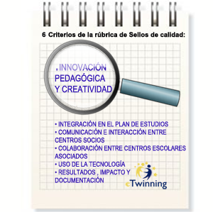
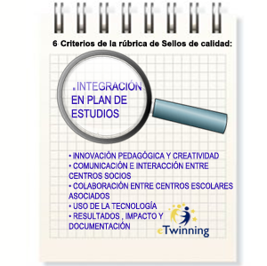
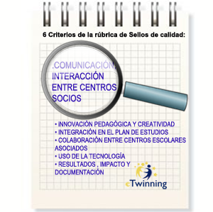
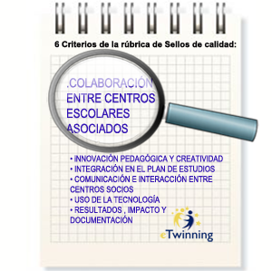
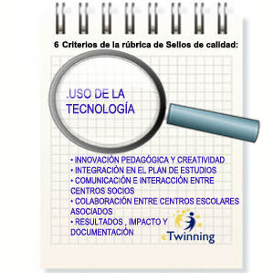
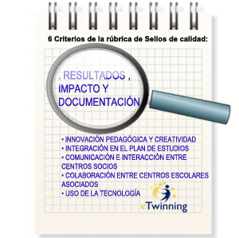

# Los criterios de calidad de un proyecto eTwinning

En este bloque vamos a descubrir los seis criterios de evaluación y sus descripciones de calidad de un proyecto eTwinning.

Dichos criterios son comunes a todos los países miembros o participantes en eTwinning, pero cabe resaltar que los distintos Servicios Nacionales de Apoyo pueden puntualizarlos y valorarlos según criterio propio y dando prioridad a uno u otro dependiendo de la singularidad de cada país.

Estos criterios pretenden ser una guía para los docentes a la hora de planificar sus proyectos y con ello ayudar a realizar y desempeñar su función de una forma más cómoda.

Los siguientes apartados son un calco de los de la [rúbrica de sello de calidad de proyectos eTwinning](http://es.slideshare.net/educacionlab/rbrica-sello-calidad-proyectos-etwinning-para-twinmooc). En cada uno de ellos podrás encontrar un enlace a artículos donde podrás descubrir buenas prácticas de dichos criterios.

En la citada rúbrica encontraremos los 6 criterios con sus diferentes escalas de valoración:

**Innovación pedagógica y creatividad**. ([enlace al artículo](http://etwinning.es/rubrica-para-un-proyecto-de-calidad-1-innovacion/?lang=es))

Fuente: [eTwinning.es](http://etwinning.es/rubrica-para-un-proyecto-de-calidad-1-innovacion/?lang=es) 

Los docentes han propuesto gran variedad de actividades en el proyecto haciendo partícipes a los alumnos: con el planteamiento de preguntas dirigidas que han favorecido la investigación y el análisis; la organización del trabajo en equipo para garantizar la colaboración; ofreciendo a los alumnos diferentes alternativas para encontrar y mostrar la información; etc.

Dependiendo del contexto y de la edad de los alumnos, la situación ha favorecido que se conviertan en verdaderos protagonistas del proyecto, el desarrollo de su creatividad,  responsabilidad y autonomía. El alumno deja de ser un mero portador de las ideas del docente.

Cada criterio tiene 6 descriptores que responden a distintos niveles de calidad. En el caso de la innovación pedagógica y creatividad, son los siguientes:

**0.** - No hay ninguna participación de alumnos ni de otros docentes.

**1. Pobre -** La mayor parte de las actividades están diseñadas por los docentes y las realizan los alumnos. No se ofrecen posibilidades para que estos participen de manera más activa.

**2. Aceptable** - Al menos algunas actividades se diseñan utilizando metodologías distintas de la clase expositiva. Los métodos de trabajo permiten que los alumnos interactúen con sus socios (por ejemplo, comparando información, trabajando juntos para obtener un producto común...).

**3. Bien** - El proyecto se diseña e implementa para que los alumnos interactúen con sus compañeros y además organicen el trabajo de forma variada (individualmente, en subgrupos, en equipos internacionales...).

**4. Muy bien** - El proyecto promueve una pedagogía interactiva y colaborativa: los métodos de aprendizaje se identifican con claridad (recogida de información, trabajo comparativo, resolución de problemas, creación colaborativa: literaria, artística, técnica, científica, periodística...).

**5. Excelente** - Además de todo lo descrito en el punto 4, existe una fuerte relación entre el rigor académico y la creatividad en la gestión y desarrollo del proyecto. Hay originalidad en el tema de trabajo elegido.

### Integración en el plan de estudios. ([enlace al artículo](http://etwinning.es/rubrica-para-un-proyecto-de-calidad-2-integracion-curricular/?lang=es))

Fuente: [eTwinning.es](http://etwinning.es/rubrica-para-un-proyecto-de-calidad-2-integracion-curricular/?lang=es) 

El trabajo del proyecto se basa en el currículo y en la programación. La mayor parte del trabajo realizado por los alumnos ha sido en horario escolar, el proyecto no se basa únicamente en el trabajo llevado a cabo por los alumnos en casa.

Se observan claros esfuerzos estratégicos para desarrollar las competencias del alumnado en diferentes áreas/materias.

El trabajo del proyecto está claramente integrado en el  trabajo escolar de alguna materia/área. El docente desarrolla el currículo mediante este proyecto eTwinning.

Cada criterio tiene 6 descriptores que responden a distintos niveles de calidad. En el caso de la integración en el plan de estudios, son los siguientes:

**0.** - No se trabaja ningún aspecto curricular.

**1. Pobre** - Se trabaja al menos una competencia curricular de manera pobre, aunque sólo sea  en lo referido al uso de las TIC.

**2. Aceptable** - El proyecto se desarrolla de manera extracurricular mediante talleres, con alumnos voluntarios. La integración curricular no es una prioridad. Los objetivos tienen un carácter más educativo que pedagógico. A pesar de eso, puede ser un proyecto excelente, creativo y original en el que los alumnos se implican enormemente, lo que le permitiría obtener buenas puntuaciones en otros criterios de evaluación de calidad.

**3. Bien** - Presenta una integración curricular obvia pero no queda explícita en la descripción del proyecto, ni en las actividades de los alumnos.

**4. Muy bien** - La integración curricular está muy clara: el proyecto se basa claramente en la metodología de aprendizaje por proyectos, cuyos objetivos permiten que los alumnos desarrollen destrezas y adquieran los aprendizajes curriculares de las áreas/materias trabajadas.

**5. Excelente** - Además de lo anterior, el marco pedagógico en el que se basa el proyecto está claramente explicado, por ejemplo,  describiendo los objetivos que se persiguen con las actividades propuestas. 

### Comunicación e interacción entre centros socios. ([enlace al artículo](http://etwinning.es/rubrica-para-un-proyecto-de-calidad-3-comunicacion-e-interaccion-entre-centros-socios/?lang=es))

Fuente: [eTwinning.es](http://etwinning.es/rubrica-para-un-proyecto-de-calidad-3-comunicacion-e-interaccion-entre-centros-socios/?lang=es) 

La mayor parte de los proyectos eTwinning desarrollan procesos de comunicación e intercambio de información entre docentes y alumnos. Se evalúa la calidad de las actividades comunicativas que los docentes diseñan para/con los alumnos permitiendo compartir el trabajo realizado sobre los temas tratados en el proyecto.

Esta comunicación puede ser tanto individual como en pequeños grupos y puede incluir votaciones, concursos, etc. diseñados para animar a los alumnos a leer, oír y/o ver el trabajo de sus compañeros.

Cada criterio tiene 6 descriptores que responden a distintos niveles de calidad. En el caso de la comunicación e interacción entre centros socios, son los siguientes:

**0.** - Hay poca evidencia de comunicación entre los docentes o los alumnos. Por ejemplo, no hay alumnos en el TwinSpace u otra plataforma similar, el docente ha trabajado solo, no hay un impacto positivo en los alumnos. 

**1. Pobre** - Se pide que los alumnos se comuniquen de manera muy limitada, por ejemplo, mediante el intercambio de emails basados en modelos (a modo de ejercicios prácticos más que como actividades de un proyecto). Es un proyecto de Pen-pal básico o “conociéndote”, pero ningún o muy pocos alumnos usan el TwinSpace u otras herramientas de comunicación; los docentes suben el trabajo de los alumnos, no hay un producto final. 

**2. Aceptable** - Los alumnos socios crean una variedad de producciones y las comparten en el TwinSpace u otra herramienta como pueden ser blogs externos. Sin embargo, los docentes han propuesto pocas actividades (o ninguna) que aseguren que los alumnos compartan de manera real. Los alumnos de cada país trabajan por separado, existe poca coordinación en los temas tratados por los docentes asociados, no se ha planificado un producto final. Algunos alumnos están dados de alta en el TwinSpace u otras herramientas comunicativas. 

**3. Bien** - Los alumnos han compartido sus productos y éstos han sido mejorados con otras aportaciones ya que los docentes han propuesto actividades específicas para que se produzca la interacción entre los alumnos de los diferentes países. El trabajo realizado por los diferentes centros ha tratado el mismo tema siguiendo instrucciones comunes o similares, por lo que los alumnos han sentido curiosidad por ver las creaciones de sus compañeros y han reaccionado a las mismas. Se han compartido temas (propuestos por el profesor), pero no hay un producto final común ni productos procesuales en el TwinSpace u otra herramienta. 

**4. Muy bien** - La información se ha compartido con objetivos claramente definidos: comparación, profundización en el aprendizaje, ampliación de los horizontes del alumno. Estos objetivos se han alcanzado mediante procesos de enseñanza diseñados por los docentes y puestos en práctica por los alumnos. La comunicación entre los alumnos ha sido un objetivo primordial guiado por los docentes (excelente uso de las herramientas de comunicación del TwinSpace u otras tales como Videoconferencia…). El trabajo se ha compartido, se han tratado temas comunes, se han debatido los temas entre los alumnos; el material está organizado, pero no hay un producto final compartido, el trabajo final de los alumnos se sube a un TwinSpace –u otra plataforma- bien organizado, aunque no haya un producto final colaborativo. 

**5. Excelente** - Además de lo anterior, los docentes han favorecido los intercambios y el compartir información como un primer paso hacia el trabajo de colaboración entre alumnos. El trabajo se ha compartido, se han tratado temas comunes, se han debatido los temas entre los alumnos, hay un resultado final.

### Colaboración entre centros escolares asociados. ([enlace al artículo](http://etwinning.es/rubrica-para-un-proyecto-de-calidad-4-colaboracion/?lang=es))

Fuente: [eTwinning.es](http://etwinning.es/rubrica-para-un-proyecto-de-calidad-4-colaboracion/?lang=es) 

Las actividades colaborativas van más allá de la comunicación: los socios nos son meros receptores de la información, son miembros de equipos, coautores y colaboradores. La colaboración implica que los centros participantes necesitan la contribución de los compañeros para completar la actividad.

Ejemplos de productos finales colaborativos: un periódico, un informe, un resumen común de todos los temas trabajados durante el proyecto, una colección de cartas redactadas sobre un tema dado, un libro de recetas, una colección de poemas, un trabajo de ficción (novela de misterio, cuento de hadas, dibujos animados, película, etc.). Estos son sólo unos cuantos ejemplos.

Los grupos internacionales son una práctica muy efectiva para el trabajo colaborativo (pequeño grupo de una clase + pequeño grupo de otra clase = grupo internacional).

Cada criterio tiene 6 descriptores que responden a distintos niveles de calidad. En el caso de la colaboración entre centros escolares asociados, son los siguientes:

**0.** - No existe ningún tipo de colaboración 

**1. Pobre** - No se han propuesto actividades o productos colaborativos pero existen intentos (aunque sean fallidos) de colaboración. Los docentes necesitan ánimos y sugerencias. 

**2. Aceptable** - Igual que en el punto anterior pero el intento de colaboración no ha sido del todo fallido y el docente podría hacerlo mejor en el próximo proyecto con unas propuestas de mejora. 

**3. Bien** -  Existen muestras claras de actividades colaborativas: un TwinSpace bien organizado u otra herramienta de comunicación, que muestre el trabajo del alumno (clasificado por temas, por ejemplo). Otro modo sería un blog bien organizado en el que se ha ido publicando todo el trabajo realizado por los alumnos y que confiere una idea clara de los intercambios y de la colaboración entre los alumnos. 

**4. Muy bien** -  Se encuentran ambos tipos de actividades en este proyecto. Las actividades de colaboración han dado como resultado un trabajo o un producto realizado utilizando herramientas especialmente adecuadas (wiki, por ejemplo) teniendo como resultado un resultado final, como un vídeo, eBook, etc. 

**5. Excelente** -  Igual que en el punto 4, pero realizado con especial maestría: producciones originales, trabajo muy riguroso llevado a cabo en grupos internacionales, etc.

### Uso de la tecnología. ([enlace al artículo](http://etwinning.es/rubrica-para-un-proyecto-de-calidad-5-uso-de-la-tecnologia/?lang=es))

Fuente: [eTwinning.es](http://etwinning.es/rubrica-para-un-proyecto-de-calidad-5-uso-de-la-tecnologia/?lang=es)

¿Qué nivel de uso de las TIC se entrevé en las actividades comunicativas y de intercambio de información por parte de alumnos y de docentes? ¿De qué manera se ha utilizado la tecnología para facilitar el trabajo en el proyecto, la creación de productos finales, etc.?

Estos criterios se centran en la evaluación de la adaptación de las herramientas tanto del TwinSpace como otras herramientas utilizadas por docentes y alumnos a la hora de realizar actividades colaborativas y compartir la información con el fin de que se produzca la interacción y una comunicación lo más real posible. Las herramientas se utilizan de manera que garantizan la consecución de los objetivos didácticos que persigue el proyecto.

Cada criterio tiene 6 descriptores que responden a distintos niveles de calidad. En el caso del uso de la tecnología, son los siguientes:

**0.** - No existe ninguna interacción y no se comparte nada. No se usa ni el TwinSpace ni ninguna otra herramienta. (Es extraño encontrar este caso) 

**1. Pobre** - Escaso uso de herramientas comunicativas tales como el TwinSpace u otras. 
* Los alumnos no están dados de alta en el TwinSpace u otras herramientas.
* Los documentos elaborados por los alumnos y docentes no se almacenan en el lugar adecuado.
* No existe una distribución del trabajo. Un docente se ha encargado de publicar todos los mensajes en los blogs, por ejemplo. 
* Cuando se muestra información, no se tienen en cuenta aspectos relativos a la seguridad en Internet tales como: no publicar fotos de los alumnos, listas con sus nombres, imágenes o música con copyright, etc. 

**2. Aceptable:**
* Únicamente algunos alumnos están dados de alta en el TwinSpace u otras herramientas. 
* Se han utilizado algunas herramientas comunicativas o del TwinSpace: herramientas básicas para intercambio de información (textos, fotos y posiblemente vídeo-presentación de imágenes).
* No todas las entradas son producciones auténticas de los alumnos (por ejemplo, documentos que contienen información copiada directamente de Internet). 
* Existe cierta conciencia sobre aspectos relativos a la seguridad; por ejemplo, los alumnos no son identificables, pero no hay preocupación sobre asuntos de copyright en imágenes, música… 

**3. Bien:**
* Se usan algunas herramientas de comunicación del TwinSpace.
* Se usan blogs comerciales pero no se ha tenido en cuenta la publicidad en los mismos. 
* Se usan herramientas creativas para el intercambio entre alumnos. 
* Se crean documentos con software para presentaciones, video, etc. 
* Existe cierta conciencia sobre aspectos relativos a la seguridad; por ejemplo, los alumnos no son identificables; se han tenido en cuenta aspectos relativos al copyright de la música e imágenes utilizadas pero no en todos los casos. 

**4. Muy bien:**
* Se usan herramientas de comunicación del TwinSpace o externas. 
* Se usan blogs comerciales sin publicidad en los que se ve un alto grado de participación por parte de TODOS los alumnos implicados en el proyecto. 
* Se usan herramientas creativas para intercambiar información. 
* Se producen documentos multimedia con el software apropiado, edición de vídeo… 
* Se usan wikis… 
* Existe conciencia plena sobre aspectos relativos a la seguridad; por ejemplo, los alumnos no son identificables; se tienen siempre en cuenta aspectos relativos al copyright de la música e imágenes utilizadas..

**5. Excelente.** Todo lo anterior se ha llevado a la práctica con un uso especialmente inteligente y creativo por parte de los alumnos.

### Resultados, impacto y documentación. ([enlace al artículo](http://etwinning.es/rubrica-para-un-proyecto-de-calidad-6-resultados-impacto-y-documentacion/?lang=es))

Fuente: [eTwinning.es](http://etwinning.es/rubrica-para-un-proyecto-de-calidad-6-resultados-impacto-y-documentacion/?lang=es) 

**Parte visible.** Los resultados del proyecto deben ser visibles:
* resultados del proyecto y/o su presentación online.
* actividad/implicación de los alumnos (TwinSpace)
* documentación del proyecto (planificación, evaluación, y reflexión, propuestas de mejora, etc.)

**Parte no visible.** Impacto del proyecto:
* en las destrezas de los docentes.
* en las destrezas de los alumnos y en la ampliación de conocimientos.
* en lo social y personal (docentes y alumnos)
* en la comunidad educativa.

Cada criterio tiene 6 descriptores que responden a distintos niveles de calidad. En el caso de los resultados, impacto y documentación, son los siguientes:

**0.** No hay resultados visibles, ni actividad del alumno, ni documentación del proyecto. 

**1. Pobre** -  Escasos resultados obtenidos (procesuales o finales) o los resultados claramente no han sido elaborados por los alumnos (sino por el docente). Poca o nula implicación del alumno en las actividades que se han documentado. No existe una documentación del proyecto o esta está fragmentada. 

**2. Aceptable** - Se presentan algunos resultados del proyecto (procesuales o finales), existe una intervención esporádica de los alumnos. La documentación del proyecto está incompleta o no es consistente con el material presentado. 

**3. Bien** - Se presentan muchos resultados del proyecto (procesuales o finales), han sido creados por los alumnos, utilizando, en su mayoría, herramientas adecuadas básicas. La documentación del proyecto contempla la evaluación (al menos los alumnos han reflejado sus opiniones que pueden servir como propuestas de mejora). Además, existen reflexiones sobre la medida en la que se han alcanzado los objetivos. El material, en su mayor parte, se ajusta a la documentación y recoge algunas notas sobre el impacto (alumnos, docentes y resto de la comunidad). 

**4. Muy bien** - Se presenta gran variedad de resultados del proyecto algunos de excelente calidad, creados por los alumnos con herramientas adecuadas. La documentación del proyecto está completa y recoge una evaluación (capacidades e impacto en los alumnos, reflexiones de los docentes) y muestra que los objetivos establecidos se han conseguido así como el impacto favorable en el resto de la comunidad. El material presentado es consistente con la documentación. 

**5. Excelente** -  Existe gran variedad de resultados presentados, la mayor parte de ellos de calidad excepcional. La documentación del proyecto es exhaustiva ya que recoge muy bien la información y la evaluación (de la mayoría o de todas las partes del proyecto), recoge también la información sobre el impacto en los alumnos y en sus capacidades /aprendizaje, en las capacidades del docente así como en el resto de la comunidad. Los objetivos establecidos se han conseguido claramente y se ha documentado de manera detallada. El material presentado se ajusta a la documentación.
