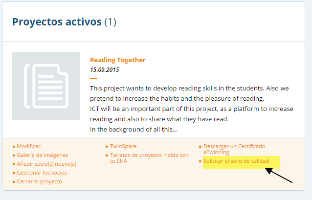

# Los sellos de calidad de un proyecto eTwinning

Los Sellos de Calidad eTwinning se entregan como forma de premiar a los profesores que han llevado a cabo proyectos eTwinning y demuestran que dichos proyectos han alcanzado unos criterios de calidad establecidos por los Servicios Nacionales y que fueron explicados en el apartado anterior.  Hay dos tipos de **sellos de Calidad:Nacional y Europeo.**

Fuente: [Portal eTwinning](https://www.etwinning.net/es/pub/progress/awards/quality_labels.htm)

<strong>Sello de Calidad Nacional</strong>

El sello de Calidad es un gran reconocimiento a los docentes y sus centros escolares por el alto valor de sus actividades y trabajos eTwinning. Y para los alumnos es algo motivador que valora de una manera especial la forma de trabajar colaborativamente con los socios europeos.

El sello de Calidad Nacional es otorgado por los Servicios Nacionales de Apoyo. Pueden ser solicitados y entregados a lo largo de cualquier momento del año en la mayoría de los casos, si bien los proyectos que se presentan han de cumplir cinco requisitos mínimos:

<li dir="ltr">
Los objetivos y el plan de trabajo ha de ser común a todos los socios del proyecto.
</li>
<li dir="ltr">
El proyecto ha de estar terminado o en vías de finalización.
</li>
<li dir="ltr">
Como docente solicitante del sello se ha de tener una participación muy activa en el proyecto.
</li>
<li dir="ltr">
Debe de detectarse un cierto grado de colaboración entre socios.
</li>
<li dir="ltr">
Se han de hacer visibles los resultados del proyecto.
</li>

El proyecto ha de estar terminado o en vías de finalización.

Debe de detectarse un cierto grado de colaboración entre socios.

Una vez que estos requisitos se cumplen, el proyecto es evaluado según los criterios de calidad que ya han sido formulados y explicados en el anterior apartado.

<li dir="ltr">
Innovación Pedagógica.
</li>
<li dir="ltr">
Inclusión en los planes de estudios.
</li>
<li dir="ltr">
Comunicación e interacción entre socios.
</li>
<li dir="ltr">
Colaboración entre centros.
</li>
<li dir="ltr">
Uso de la Tecnología.
</li>
<li dir="ltr">
Resultado, Impacto y Documentación.
</li>

Inclusión en los planes de estudios.

Colaboración entre centros.

Resultado, Impacto y Documentación.

Para comenzar la solicitud de el sello de Calidad, se hará desde el [portal de eTwinning. ](https://www.etwinning.net/es/pub/index.htm)

Imagen tomada de [eTwinning LIve](https://live.etwinning.net/unauthorized)

<strong>Sello de Calidad Europeo</strong>

El sello de Calidad Europeo es un segundo reconocimiento. Desde 2012, el Servicio Nacional de Apoyo lo otorgará a los centros que se encuentren en un proyecto en que:

<li dir="ltr">
Hayan sido propuestos para el Sello de Calidad Europeos al menos desde un SNA tras su evaluación.
</li>
<li dir="ltr">
Al menos dos socios ya hayan recibido el Sello de Calidad Nacional. 
</li>

Al menos dos socios ya hayan recibido el Sello de Calidad Nacional. 
