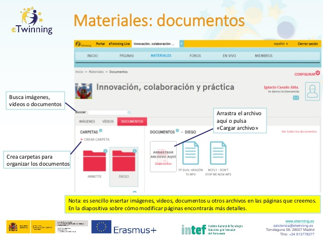

# Materiales: documentos.

**Materiales: documentos.** En muy importante recoger las tareas o actividades realizadas por el alumnado durante el proyecto y a veces surgen muchos documentos offline u online (herramientas 2.0) como resultado. Puedes ver como hacerlo en la siguiente imagen. Si quieres ampliar más información puedes hacerlo en el artículo [Insertar herramientas 2.0 en el TwinSpace](http://www.etwinning.es/es/formacion/minitutoriales/928-insertar-herramientas-20-en-el-twinspace) de eTwinning.es. En este apartado podrás:

* rear carpetas para organizar los documentos.

* Buscar imágenes, vídeos o documentos.

* Arrastrar el archivo aquí o pulsar «Cargar archivo».

> Nota: es sencillo insertar imágenes, vídeos, documentos u otros archivos en las páginas que creemos. En el apartado sobre cómo modificar páginas encontrarás más detalles.
