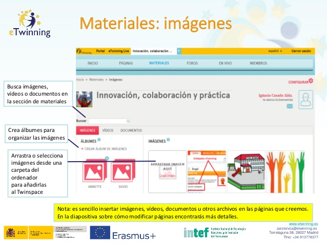

# Materiales: Imágenes.

**Materiales: Imágenes.** En muy importante compartir fotos o imágenes de cualquier actividad que tiene relación con el proyecto y el aula. Puedes ver cómo hacerlo en la siguiente imagen. Si quieres ampliar más información puedes hacerlo en el artículo [Subir vídeos e imágenes al nuevo TwinSpace](http://www.etwinning.es/es/formacion/minitutoriales/904-subir-videos-e-imagenes-al-nuevo-twinspace) de eTwinning.es. En este apartado podrás:

* Crear álbumes para organizar las imágenes.

* Arrastrar o seleccionar imágenes desde una carpeta del ordenador para añadirlas al Twinspace.

* Buscar imágenes, vídeos o documentos en la sección de materiales.

> Nota: es sencillo insertar imágenes, vídeos, documentos u otros archivos en las páginas que creemos. En el apartado sobre cómo modificar páginas encontrarás más detalles.
