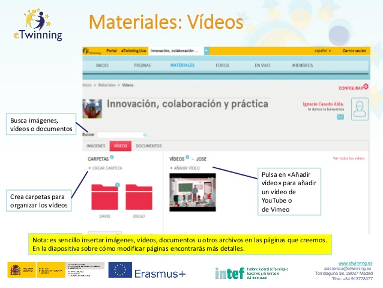

# Materiales: vídeos.

**Materiales: vídeos.** En muy importante compartir vídeos ya sea de tareas realizadas por el alumnado o momentos de actividad en el aula realizando el proyecto. Puedes ver cómo hacerlo en la siguiente imagen. Si quieres ampliar más información puedes hacerlo en el artículo [Gestión de videos en el TwinSpace](http://www.etwinning.es/es/formacion/minitutoriales/995-gestion-de-videos-en-el-twinspace) de eTwinning.es. En este apartado podrás:

* Crear carpetas para organizar los vídeos.

* Buscar imágenes, vídeos o documentos.

* Pulsar en «Añadir vídeo» para añadir un vídeo de YouTube o de Vimeo.

> Nota: es sencillo insertar imágenes, vídeos, documentos u otros archivos en las páginas que creemos. En el apartado sobre cómo modificar páginas encontrarás más detalles.
