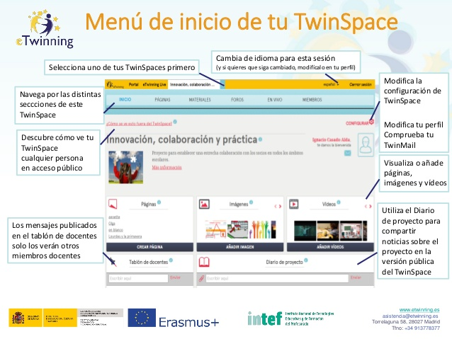

# Menú de inicio de tu TwinSpace.

**Menú de inicio de tu TwinSpace:** una vez en tu Twinspace, podrás hacer:

* Seleccionar uno de tus TwinSpaces, si es que tuvieras más de un proyecto.

* Cambiar el idioma para la sesión.

* Modificar la configuración de TwinSpace.

* Modificar tu perfil y comprobar tu TwinMail.

* Visualizar o añadir páginas, imágenes y vídeos.

* Utilizar el Diario de proyecto para compartir noticias sobre el proyecto en la versión pública del TwinSpace.

* Ver los mensajes publicados en el tablón de docentes (solo los verán otros miembros docentes).

* Descubrir cómo ve tu TwinSpace cualquier persona en acceso público.

