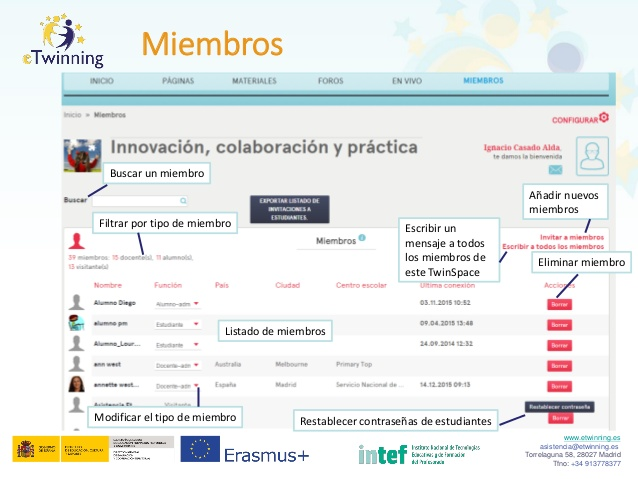

# Miembros.

**Miembros.** Como hemos visto a lo largo de los diferente módulos y bloques, es esencial que aparte de los docentes, los alumnos participen en la plataforma TwinSpace. En la siguiente imagen aprenderás qué puedes hacer en este apartado.

* Buscar un miembro.

* Filtrar por tipo de miembro.

* Listado de miembros.

* Modificar el tipo de miembro.

* Eliminar miembro.

* Restablecer contraseñas de estudiantes.

* Añadir nuevos miembros.

* Escribir un mensaje a todos los miembros de este TwinSpace.

