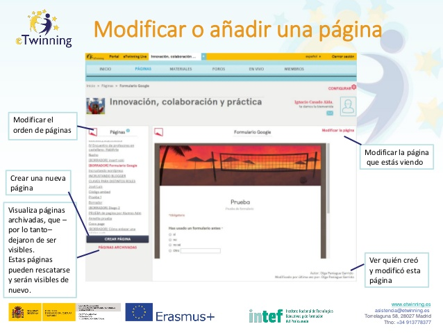

# Modificar o añadir una página.

**Modificar o añadir una página: **en la imagen que se encuentra debajo se observan las diferentes funciones que se pueden hacer en una página. Aunque si quieres ampliar más información puedes hacerlo en el artículo [Gestión de páginas en el twinspace](http://www.etwinning.es/es/formacion/minitutoriales/964-gestion-de-paginas-en-el-twinspace) de eTwinning.es. En el siguiente listado verás las posibilidades de este apartado.

* Modificar el orden de páginas.

* Modificar la página que estás viendo.

* Ver quién creó y modificó esta página.

* Visualizar páginas archivadas, que, por lo tanto, dejaron de ser visibles. Estas páginas pueden rescatarse y serán visible de nuevo.

