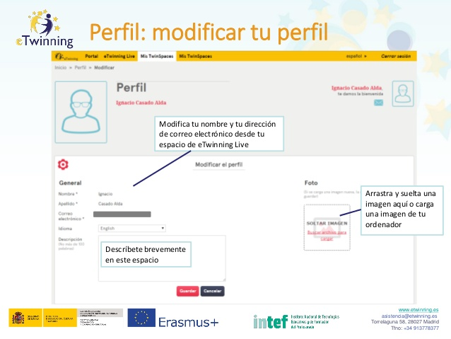

# Perfil: modificar tu perfil.

**Perfil: modificar tu perfil.** El perfil (incluye una imagen y una breve descripción) será visible en todos los TwinSpaces en los que estés incluido. Los docentes deberían dar a sus estudiantes unas pautas a seguir sobre cómo escribir su descripción: qué idioma, qué tipo de información deben compartir y cuál no, etc. Lo mismo tendrán que hacer con el avatar o imagen de perfil, ya que una imagen vale más que mil palabras. Es recomendable no borrar la foto de perfil de los estudiantes. Aquí podrás:

* Modificar tu nombre y tu dirección de correo electrónico desde tu espacio de eTwinning Live.

* Arrastrar y soltar una imagen aquí o cargar una imagen de tu ordenador.

* Describirte brevemente en este espacio.

