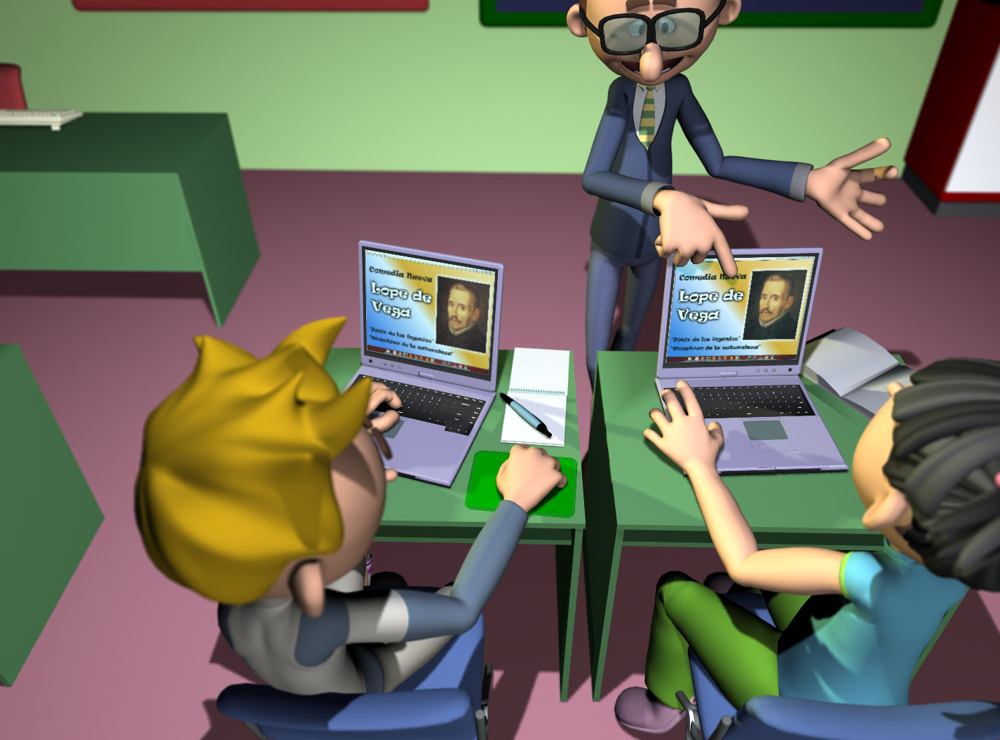
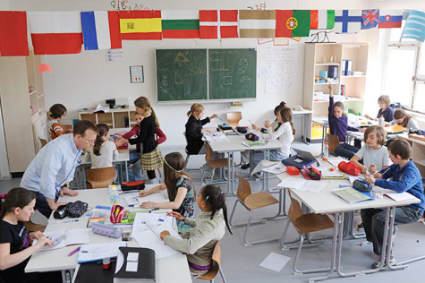

# ¿Qué es el ABP?

El Aprendizaje Basado en Proyectos (ABP / PBL) se ha convertido en una de las metodologías activas más eficaz y cada vez más extendida en nuestro sistema educativo.

En la metodología ABP los alumnos llevan a cabo un proceso de investigación y creación que culmina con la respuesta a una pregunta, la resolución de un problema o la creación de un producto. Los proyectos han de planearse, diseñarse y llevarse a cabo con el fin de que el alumno pueda incorporar, de una manera factual, los contenidos y estándares de aprendizaje establecidos por la legislación educativa. La implementación del ABP permite que se puedan diseñar los temas e itinerarios de aprendizaje con mayor libertad, de forma que el producto final ya no es lo único importante sino que también son relevantes el proceso de aprendizaje, la profundización y el desarrollo de las competencias clave.

 Los proyectos han de ser planeados, diseñados y llevados a cabo de tal manera que el alumno incorpore de una manera factual los contenidos y estándares de aprendizaje establecidos por la legislación educativa. Si bien, la implementación del ABP permite que se puedan diseñar los temas y los itinerarios de aprendizaje con mayor libertad. Así, el producto final deja de ser lo único importante y, junto a él, se presta atención al proceso de aprendizaje , la profundización llevada a cabo por los alumnos, así como el desarrollo de las competencias clave.

[CeDeC,](https://www.flickr.com/photos/70768379@N05/) **Profes y alumnos trabajan con portátiles.**  ([CC BY-SA 2.0](https://creativecommons.org/licenses/by-sa/2.0/))

El Aprendizaje Basado en Proyectos ha de incluir competencias y habilidades del S.XXI para el alumnado:

<li dir="ltr">
**<strong>Colaboración</strong>:** los alumnos necesitarán tiempos de trabajo establecidos y guiados hasta que sean capaces de llevarlo a cabo por su cuenta. Para ello será necesario facilitarles estrategias para la colaboración y la cooperación: 
</li>
<ul>
<li dir="ltr">
el uso de roles de trabajo.
</li>
<li dir="ltr">
diarios de trabajo.
</li>
<li dir="ltr">
trabajo por objetivos diarios. 
</li>
<li dir="ltr">
las dinámicas del aprendizaje cooperativo.
</li>

el uso de roles de trabajo.

trabajo por objetivos diarios. 

<li dir="ltr">
**<strong>Comunicación</strong>:** Saber comunicar qué se quiere, cómo se quiere y cuándo se quiere son aspectos fundamentales para que se produzca una buena colaboración. Para ello es necesario que los alumnos dipongan de tiempo organizado para realizar: puestas en común; el planteamiento y resolución de dudas; y la evaluación de su propio trabajo
</li>

<li dir="ltr">
**<strong>Pensamiento Crítico</strong>:** Los proyectos han de desarrollar la capacidad de pensar en el alumnado. Además, el análisis de información, la toma de decisiones y la defensa de posiciones encontradas son estrategias que desarrollarán los alumnos en el proceso de trabajo. Para que pueda llevarse a cabo, el profesorado tendrá que guiar cuidadosamente la oferta de estrategias y herramientas. Las rutinas de pensamiento son estrategias cognitivas, preguntas u organizadores gráficos sencillos que promueven el desarrollo y la estructuración del pensamiento en los alumnos. Fueron desarrolladas por investigadores de la Universidad de Harvard dentro del [Proyecto Zero (2008)](http://www.pz.harvard.edu/).
</li>

<li dir="ltr">
**<strong>Nuevas Tecnologías</strong>:** Las TIC se convierten en algo central en el Aprendizaje Basado en Proyectos, si bien no podemos considerarlo como algo fundamental e imprescindible. Las TIC abren nuestras aulas al mundo globalizado de la información y la comunicación, por lo tanto nos ofrecen herramientas para la investigación, la creación y la difusión del trabajo. Uno de los puntos importantes de su uso es la facilidad de colaborar a la hora de trabajar en equipo, destacando especialmente el [uso de las herramientas Google](https://www.google.es/edu/) aplicadas a la educación.
</li>

 

[Demonstración de una actividad de clase siguiendo el aprendizaje basado en proyectos](https://en.wikipedia.org/wiki/Activity-based_learning_in_India#/media/File:BMS_classrooms.jpg), Jens Rötzsch, ([CC BY-SA 3.0](https://creativecommons.org/licenses/by-sa/3.0/deed.en))

La metodología ABP no sólo supone la realización de meros trabajos:

<li dir="ltr">
Es necesario la creación y el diseño pormenorizado del <strong>escenario de aprendizaje</strong>. Este escenario tendrá que parecerse lo más posible a la realidad, una realidad cercana al alumno,  ya que se busca un aprendizaje útil y vivencial.
</li>
<li dir="ltr">
Los docentes son<strong> guías del itinerario</strong> de aprendizaje en el proceso del proyecto  y en la reflexión sobre el mismo. El acento no ha de colocarse en el producto final sino en el cómo y por qué se ha llegado hasta allí.
</li>
<li dir="ltr">
La <strong>flexibilidad</strong> en el diseño y creación del proyecto no es un “todo vale”. El itinerario creado ha de estar <strong>fundamentado</strong>, ser útil, tener sentido (especialmente para el alumnado) y estar integrado en el currículum educativo y en las programaciones. 
</li>
<li dir="ltr">
El desarrollo de la <strong>autonomía</strong> en el alumnado no significa “ahí te las apañes”. Los docentes estamos obligados a <strong>facilitar</strong> herramientas, guías, objetivos, preguntas y respuestas que lleven al alumno al éxito.
</li>

Los docentes son<strong> guías del itinerario</strong> de aprendizaje en el proceso del proyecto  y en la reflexión sobre el mismo. El acento no ha de colocarse en el producto final sino en el cómo y por qué se ha llegado hasta allí.

El desarrollo de la <strong>autonomía</strong> en el alumnado no significa “ahí te las apañes”. Los docentes estamos obligados a <strong>facilitar</strong> herramientas, guías, objetivos, preguntas y respuestas que lleven al alumno al éxito.

 
