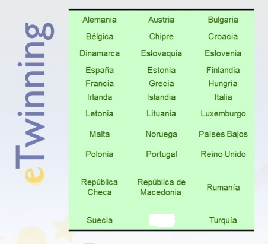
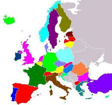

# ¿Qué es eTwinning?

eTwinning es una iniciativa de la Comisión Europea en modo de programa educativo que promueve la colaboración y hermanamiento de dos o más centros escolares, ya sea de un mismo país o de distintos países europeos. Dicho hermanamiento sirve para establecer proyectos educativos sobre cualquier tema del ámbito escolar, basados en el trabajo en colaboración, desarrollo de las competencias clave, el uso de las TIC y la potenciación de la dimensión europea.

Hay que destacar los aspectos positivos de estos hermanamientos como: el sentido de creación de comunidad con otros centros; las posibilidades de aprendizaje entre pares, ya sea entre docentes o entre alumnos; pero, sobre todo, destacaremos la posibilidad de compartir ideas y experiencias para el crecimiento personal o colectivo dentro de la sociedad europea.

Fuente: [eTwinning.es](http://etwinning.es/?lang=es)

eTwinning comenzó como iniciativa Europea en el 2005, como parte fundamental del programa eLearning de la Unión Europea para la integración de las tecnologías de la información y la comunicación (TIC) en los sistemas de educación y formación en Europa.

Desde 2014, eTwinning está integrado en programa Erasmus +, dentro de la Acción 2: Cooperación para la innovación y el intercambio de buenas prácticas.

La estructura del programa es la siguiente:

- Participan un total de 41 países donde 28 son estados miembro de la UE, 7 países candidatos o con relación especial y 6 países eTwinning Plus (los cuales desarrollaremos en otro punto del bloque).

 

Fuente: [eTwinning.es](http://etwinning.es/?lang=es)

 

Fuente: [eTwinning.es](http://etwinning.es/?lang=es)

 

<li dir="ltr" style="text-align: left;">
eTwinning está organizado a nivel europeo por el Servicio Central de Apoyo (SCA), con sede en Bruselas ([http://www.etwinning.net](http://www.etwinning.net/)) y a nivel nacional está coordinado por los respectivos Servicios Nacionales de Apoyo. En España, el Servicio Nacional de Apoyo (SNA) pertenece al Instituto Nacional de Tecnologías Educativas y de Formación del Profesorado (INTEF) del Ministerio de Educación, Cultura y Deporte, desde donde trabaja en coordinación con todas las Comunidades y Ciudades Autónomas ([http://www.etwinning.es](http://www.etwinning.es/)).
Las condiciones de participación son:
<ul>
<li dir="ltr">
Niveles educativos anteriores a la Universidad.
</li>
<li dir="ltr">
Todas las materias, interdisciplinar, transversal…
</li>
<li dir="ltr">
Lengua de trabajo: todas (entre ellas, el español, cuyo uso crece día a día en Europa).
</li>
<li dir="ltr">
Perfil de participantes: docentes, alumnos, equipos directivos, asesores de centros de profesores, inspectores, bibliotecarios...
</li>

Las condiciones de participación son:

Todas las materias, interdisciplinar, transversal…

Perfil de participantes: docentes, alumnos, equipos directivos, asesores de centros de profesores, inspectores, bibliotecarios...

Con datos de participación del 19 de febrero de 2016:

<li dir="ltr">
En [Europa](https://www.etwinning.net/en/pub/news/press_corner/statistics.cfm) hay:
</li>
<ul>
<li dir="ltr">
47506 proyectos.
</li>
<li dir="ltr">
155103 centros.
</li>
<li dir="ltr">
361589 profesores registrados
</li>

47506 proyectos.

361589 profesores registrados

En [España](http://etwinning.es/?lang=es) hay:

<li dir="ltr">
2321 proyectos curso 2015-16.
</li>
<li dir="ltr">
11373 centros registrados.
</li>
<li dir="ltr">
30131 docentes inscritos.
</li>

11373 centros registrados.

Fuente de los datos: [eTwinning.net](https://www.etwinning.net/en/pub/news/press_corner/statistics.cfm) - [eTwinning.es](https://www.etwinning.net/es/pub/news/press_corner/statistics.cfm)
