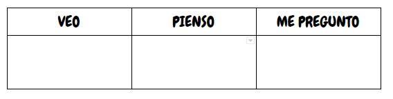

# ¿Qué es eTwinning? Introducción

Para dar comienzo al bloque 1 vamos a llevar a cabo una rutina de pensamiento sobre el siguiente vídeo:

https//www.youtube.com/watch?v=fquigz95jag

[Vídeo YouTube - eTwinning SNA - España](https://www.youtube.com/watch?v=fquigz95jag) (1:18)

La rutina de pensamiento se llama<strong> VEO-PIENSO-ME PREGUNTO</strong> y consta de escribir varias frases o palabras describiendo lo que has visto, has pensado y te has preguntado durante el vídeo.

Las conclusiones de la rutina de pensamiento te serán útiles para la realización de la primera tarea. 

