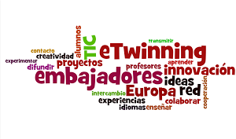
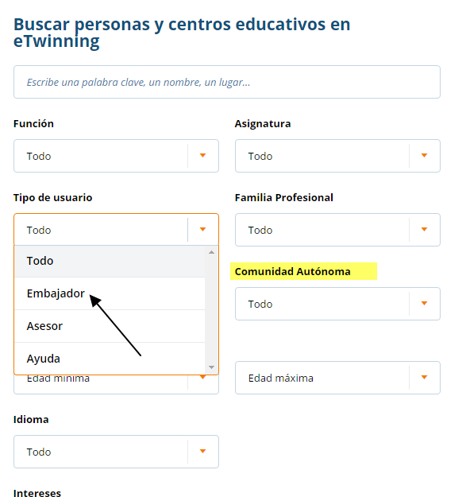

# ¿Qué es un embajador eTwinning?

Un embajador eTwinning es un docente con una gran experiencia en el trabajo y desarrollo de eTwinning. Es decir, son profesores que han llevado a cabo diferentes proyectos, los cuales han conseguido, en diferentes ocasiones, el reconocimiento del [Sello de Calidad Nacional o Europeo](http://www.etwinning.es/es/ideas/recomendaciones/943-criterios-de-evaluacion-de-sellos-de-calidad-nacional) ([criterios](http://etwinning.es/criterios-de-evaluacion-de-sellos-de-calidad-nacional-etwinning/?lang=es)) o han sido galardonados con el premio Nacional o Europeo que eTwinning ofrece.

La red de Embajadores eTwinning está siempre al servicio de cualquiera de los docentes que quiera comenzar, que tenga dudas en el camino o que necesite de ellos para la promoción de eTwinning. Como docente no dudes en entrar en contacto con ellos, recuerda que su misión es ayudarte. Existen diferentes maneras de poder encontrar quién es el embajador más cercano al centro educativo o aquel embajador que más te interesa. Al pie de esta página encontrarás más información al respecto. 

Esta red de profesionales tiene como labor la difusión de eTwinning y sus beneficios así como la formación de profesorado, tanto presencial como online, a través de talleres en centros de profesores, presentaciones en congreso y jornadas, o asesoramiento mediante el contacto directo con ellos.

En la red nacional de Embajadores de eTwinning hay profesorado de Educación Infantil, Primaria, de Secundaria y Formación Profesional, los cuales no se distinguen exclusivamente por su buen hacer en eTwinning sino por el entusiasmo respecto a la metodología colaborativa de aprendizaje basado en proyectos (ABP) que este programa lleva implícita. 

Entre los trabajos llevados a cabo por un embajador eTwinning estarían:

* Colaborar con el Servicio Nacional de Apoyo (SNA) y las Comunidades Autónomas en la formación y el apoyo de docentes. 
* Ser referente en un entorno próximo a los docentes implicados en aspectos tanto pedagógicos como técnicos. 
* Generar interacción entre los diferentes docentes que trabajan  en la plataforma y el propio servicio de eTwinning. 
* Participar en la formación ofrecida por el SNA para continuar ampliando y profundizando en el conocimiento del programa y la plataforma. 

La selección y designación de un Embajador eTwinning se produce de manera conjunta entre el SNA y las diferentes Comunidades Autónomas.

En los siguientes links podrás encontrar todos los Embajadores eTwinning de la red española.

* [Mapa Embajadores eTwinning en España.](https://www.etwinning.net/en/pub/connect/browse_people_schools_and_pro/ambassadors.cfm?c=724#results)

* [Listado de Embajadores eTwinning curso 2015-2016](http://etwinning.es/listado-de-embajadores-etwinning-20152016/?lang=es)

Dentro de la plataforma eTwinning Live, en el propio perfil del docente, podremos buscar personas dentro de la red eTwinning. Si a en el momento de realizar esa búsqueda se elige el tipo de usuario que se busca como Embajador, encontraremos docentes con dicha misión. Además, se puede orientar la búsqueda estableciendo criterios de país, Comunidad Autónoma, etc.

El [blog de Embajadores Nacionales](http://embajadoresetwinning.blogspot.com.es/) es el lugar donde este equipo de docentes muestra las diferentes acciones formativas y de difusión llevadas a cabo en los diferentes lugares en los que trabajan. Además, se ha convertido en un espacio para el intercambio de experiencias, la comunicación y la reflexión. 

Existen también diferentes webs y blog generados por los embajadores de una determinada área o Comunidad Autónoma:

[Embajada eTwinning Asturias.](http://embajadaetwinningasturias.blogspot.com.es/?m=0)

[Ambaixada Catalana d’eTwinning.](http://ambaixadacatalanaetwinning.blogspot.com.es/)

[Embajada eTwinning Ceuta. ](http://embajadaetwinningceuta.blogspot.com/)

[eTwinning Extremadura](http://etwinning.educarex.es/)

[Embaixada eTwinning Galicia.](http://embaixadaetwinning.blogspot.com.es/)

[Embajada eTwinning La Rioja](https://etwinninglarioja.wordpress.com/)

[Embajada eTwinning Murcia](http://etwinnico.blogspot.com/p/equipo-de-embajadores.html)

[eTwinning Navarra](http://etwinningnavarra.blogspot.com/)