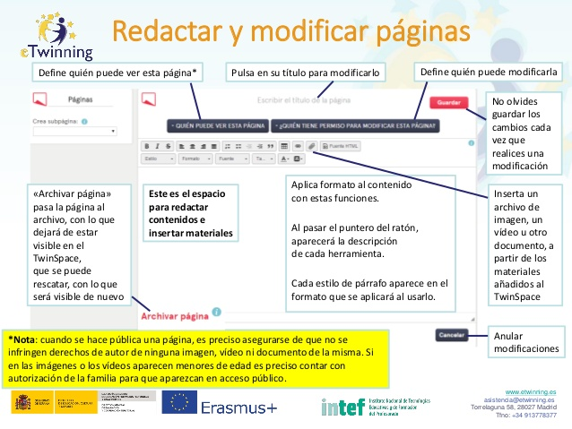

# Redactar y modificar una página.

**Redactar y modificar una página.** Como puedes observar en la ilustración en este apartado podrás:

* Definir quién puede ver esta página.

* Pulsar en su título para modificarlo.

* Definir quién puede modificar la página.

* Guardar los cambios cada vez que realices una modificación (No lo olvides).

* Insertar un archivo de imagen, un vídeo u otro documento, a partir de los materiales añadidos al TwinSpace.

* Aplicar formato al contenido con estas funciones. Al pasar el puntero del ratón, aparecerá la descripción de cada herramienta. Cada estilo de párrafo aparece en el formato que se aplicará al usarlo. Inserta un archivo de imagen, un vídeo u otro documento, a partir de los materiales añadidos al TwinSpace.

* «Archivar página» pasa la página al archivo, con lo que dejará de estar visible en el TwinSpace, que se puede rescatar, con lo que será visible de nuevo.

* Anular modificaciones.

> Nota: cuando se hace pública una página, es preciso asegurarse de que no se infringen derechos de autor de ninguna imagen, vídeo ni documento de la misma. Si en las imágenes o los vídeos aparecen menores de edad es preciso contar con autorización de la familia para que aparezcan en acceso público. Este es el espacio para redactar contenidos e insertar materiales.